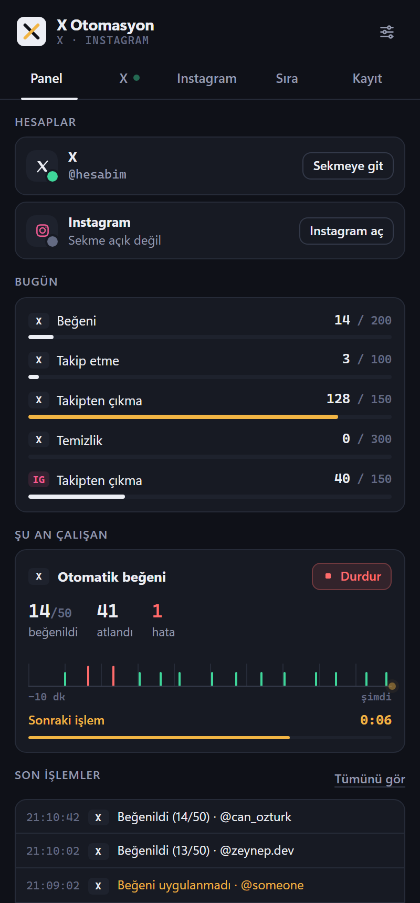
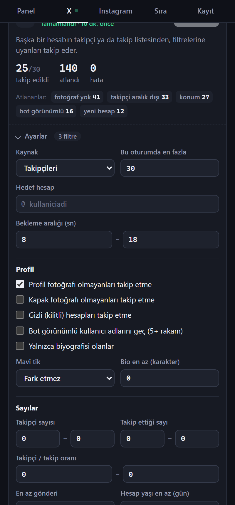
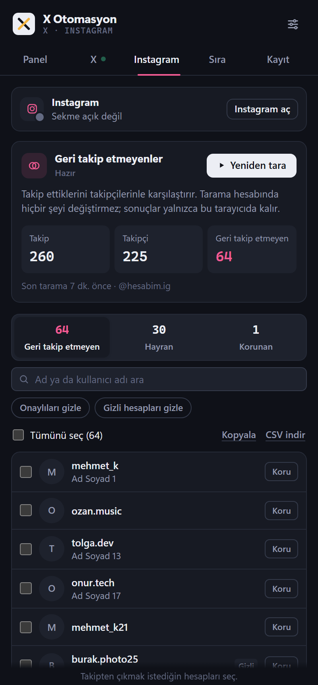
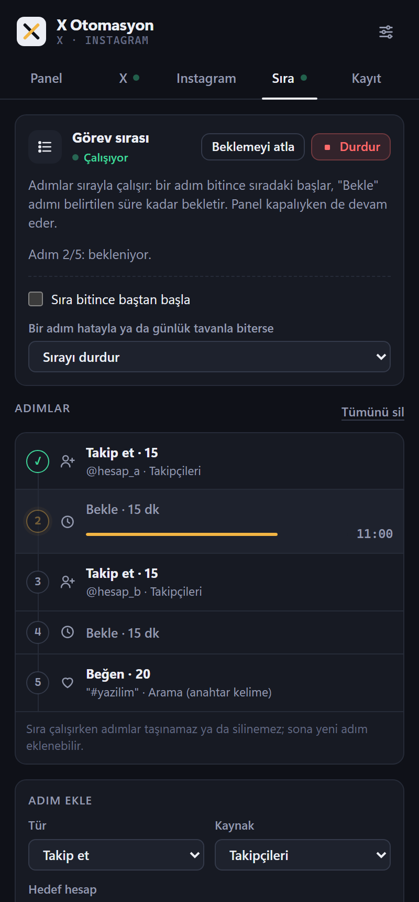
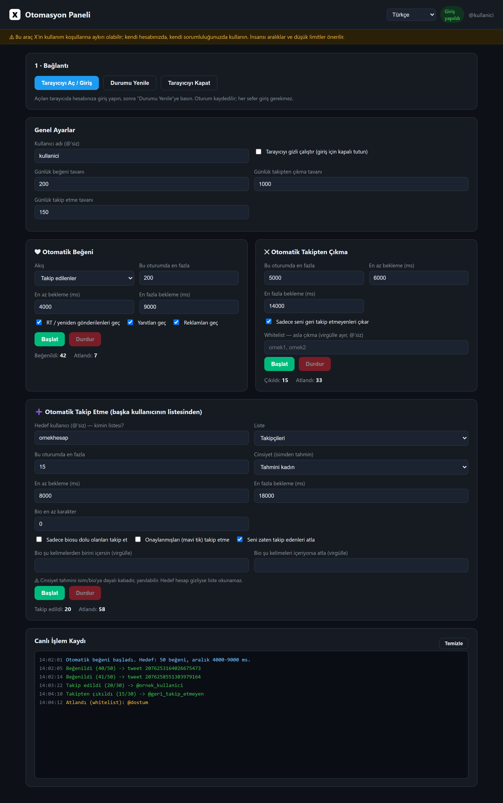
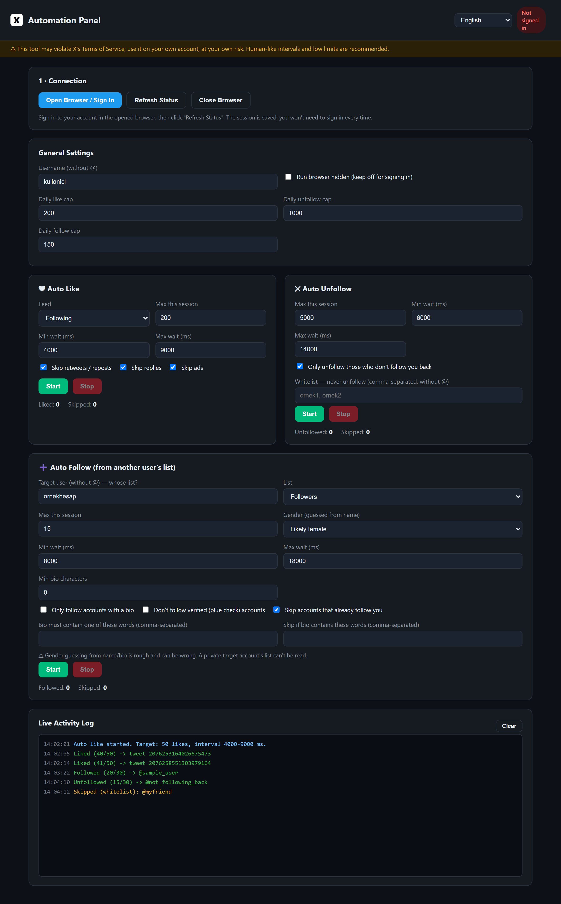

<div align="center">


# X Otomasyon

**Kendi X (Twitter) ve Instagram hesabın için tarayıcı içi otomasyon** — filtreli takip, otomatik beğeni, geri takip etmeyenleri bırakma, hesap temizliği ve adım adım çalışan görev sırası.

_Browser automation for **your own** X (Twitter) and Instagram accounts — filtered follow, auto-like, unfollow non-followers, account cleanup and a step-by-step task queue._


[Türkçe](#-türkçe) · [English](#-english)






</div>

---

> [!WARNING]
> Otomatik beğeni, takip ve takipten çıkma **X ve Instagram kurallarına aykırıdır** ve hesabının kısıtlanmasına ya da askıya alınmasına yol açabilir. Yalnızca **kendi hesabında**, düşük limitler ve geniş aralıklarla, **kendi sorumluluğunda** kullan.
> _Auto-liking, following and unfollowing **break X's and Instagram's rules** and can get your account restricted or suspended. Use it only on **your own account**, with low limits and wide intervals, **at your own risk**._

---

## 🇹🇷 Türkçe

### Bu proje nedir?

İki parçadan oluşur:

| | Ne | Nasıl çalışır |
|---|---|---|
| 🧩 **Chrome eklentisi** (önerilen) | X + Instagram, yan panelde modern arayüz | Zaten oturum açık olduğun sekmelerde çalışır. Kurulum, Node veya ayrı tarayıcı gerekmez. |
| 🖥️ **Masaüstü uygulaması** (ilk sürüm) | Yalnızca X | Electron + Playwright; kendi Chromium'unu açar. |

API anahtarı gerekmez: eklenti sayfanın kendi düğmelerine tıklar, Instagram'da ise sitenin kendi web isteklerini senin oturumunla kullanır. **Hiçbir veri bir sunucuya gönderilmez**; ayarlar, kayıtlar ve sonuçlar yalnızca tarayıcında (`chrome.storage`) durur.

### Özellikler

**X (Twitter)**

| Modül | Ne yapar |
|---|---|
| ❤️ **Otomatik beğeni** | Kaynak: *Takip edilenler* / *Sana özel* akışı, anahtar kelime araması ya da bir hesabın gönderileri. Filtreler: yeniden gönderi, yanıt, reklam, kelime içersin/içermesin, gönderi dili, en fazla N saatlik, profil fotoğrafı olmayan ya da onaylı yazarları geç. |
| ➕ **Filtreli takip** | Kaynak: bir hesabın takipçileri / takip ettikleri / onaylı takipçileri, kişi araması, bir gönderiyi yeniden gönderenler ya da *seni takip edenler (geri takip)*. Filtreler aşağıda. |
| ✂️ **Takipten çıkma** | Seni geri takip etmeyenleri bırakır. Fotoğrafsız hesapları her durumda bırakma, onaylıları ve çok takipçilileri koruma, *yalnızca eklentinin takip ettiklerini N gün sonra bırakma*, beyaz liste. |
| 🧽 **Hesap temizliği** | Kendi profilinde beğenilerini ya da yeniden gönderilerini geri alır (N günden eskiler). Gönderi silmez. |
| 📊 **Takip geçmişi** | Eklentiyle takip edilen / geri takip eden / bırakılan hesaplar, geri dönüş oranı, CSV dışa aktarma. |

**Filtreli takip filtreleri**

- **Profil:** profil fotoğrafı yoksa takip etme · kapak fotoğrafı yoksa takip etme · gizli (kilitli) hesaplar · mavi tik (fark etmez / geç / yalnızca onaylılar) · bot görünümlü kullanıcı adı (5+ rakam) · biyografi zorunlu / en az N karakter
- **Sayılar:** takipçi aralığı · takip ettiği aralığı · takipçi/takip oranı · en az gönderi · en az hesap yaşı (gün)
- **Metin:** bio, ad/kullanıcı adı ve konum için "içersin / içermesin" kelimeleri
- **Diğer:** isimden tahmini cinsiyet · seni zaten takip edenleri geç · daha önce takip ettiğin ya da bıraktığın hesapları tekrar takip etme

> Takipçi sayısı, hesap yaşı, kapak ve konum gibi bilgiler **X'in sayfaya zaten yüklediği verilerden** okunur; eklenti ek istek göndermez. Her görevin altında **atlanma nedenleri** dökümü gösterilir (ör. *fotoğraf yok 41 · konum 27*), böylece hangi filtrenin ne kadar elediğini görürsün.

**Instagram** ([cobanov/instagram](https://github.com/cobanov/instagram) yaklaşımı)

- Takip ettiklerini takipçilerinle karşılaştırır: **geri takip etmeyenler**, **hayranlar** (seni takip edip senin takip etmediklerin) ve **korunanlar**.
- Arama, onaylı/gizli hesap filtreleri, kopyala ve CSV indir.
- Seçtiklerini **yavaş tempoda** takipten çıkarır: işlemler arası bekleme, belirli aralıklarla uzun mola, günlük tavan. Instagram engellerse hemen durur.
- Tarama yarıda kalırsa (hız sınırı, oturum vb.) **kaldığı yerden sürer**. Tarama hesabında hiçbir şeyi değiştirmez.

**Görev sırası**

Adımları sırayla çalıştırır. Örnek:

```
1. @hesap_a takipçilerinden 15 kişi takip et
2. 15 dk bekle
3. @hesap_b takipçilerinden 15 kişi takip et
4. 15 dk bekle
5. "#yazilim" aramasında 20 gönderi beğen
```

- Adım türleri: takip et, beğen, takipten çık, temizle, bekle.
- **Hızlı kurulum:** `a, b, c` + adet + bekleme yaz; adımlar otomatik oluşur.
- Bitince baştan başla (döngü); bir adım hata ya da günlük tavanla biterse sırayı durdur ya da sonrakine geç; beklemeyi atla.
- Sırayı arka plan yürütür; **panel kapalıyken de devam eder**.

**Panel**

- Hesap durumu, günlük tavanlar ve kullanım çubukları.
- **Tempo** çizgisi: son 10 dakikadaki işlemler ve bir sonraki işleme geri sayım.
- Canlı işlem kaydı (filtrelenebilir, dışa aktarılabilir), açık/koyu tema, 6 dil.

### Kurulum (Chrome eklentisi)

1. Bu repoyu indir: **Code → Download ZIP** ve klasöre çıkar (ya da `git clone`).
2. Chrome'da `chrome://extensions` adresini aç, sağ üstten **Geliştirici modu**nu aç.
3. **Paketlenmemiş öğe yükle** → reponun içindeki **`extension/`** klasörünü seç.
4. Araç çubuğundaki **X Otomasyon** ikonuna tıkla → yan panel açılır.

> Güncellemeden sonra `chrome://extensions` sayfasında eklentinin **yenile (↻)** düğmesine bas.

### Kullanım

1. **x.com** ve/veya **instagram.com**'da oturum aç.
2. Panelde **X** bölümünden bir modülün **Ayarlar**'ını aç, filtreleri ve limitleri belirle, **Başlat**'a bas. Eklenti gerekirse doğru sayfaya (akış, takip listesi, hedef hesabın takipçileri) kendisi gider.
3. **Instagram** bölümünde **Tara** → listeden seç → **Takipten çık**. Saklamak istediğin hesaplara **Koru** de.
4. Birden çok işi arka arkaya yapmak için **Sıra** bölümünü kullan.

**İpuçları**

- X görevleri açık sekmede çalışır; görev sürerken **X sekmesini görünür tut** (ayrı bir pencerede olabilir). Arka plandaki sekmede X yeni içerik yüklemeyebilir.
- Aynı platformda aynı anda tek görev çalışır; görevin sekmesi kapanırsa görev durur.
- X art arda 3 işlemi uygulamazsa (büyük olasılıkla hız sınırı) görev kendini durdurur.
- Başlangıç için öneri: takipte günde 50–100, işlemler arası 10–30 sn.

### Masaüstü uygulaması (yalnızca X)

İlk sürüm; Playwright ile kendi Chromium'unu açan Electron uygulaması. Beğeni, takipten çıkma ve filtreli takip içerir.

- **Hazır kurulum (Windows):** [release/X-Otomasyon-Setup-1.0.0.exe](release/X-Otomasyon-Setup-1.0.0.exe) — SmartScreen uyarırsa *Ek bilgi → Yine de çalıştır* (uygulama imzasız).
- **Kaynaktan:** Node.js 18+ gerekir.

```bash
npm install
npx playwright install chromium
npm run desktop    # masaüstü penceresi
npm start          # web modu: http://localhost:4477
npm run dist       # release/ içine Windows kurulumu üretir
```



---

## 🇬🇧 English

### What is this?

Two parts:

| | What | How it runs |
|---|---|---|
| 🧩 **Chrome extension** (recommended) | X + Instagram, modern side-panel UI | Runs in the tabs you're already signed in to. No install, no Node, no separate browser. |
| 🖥️ **Desktop app** (first version) | X only | Electron + Playwright; opens its own Chromium. |

No API key: the extension clicks the page's own buttons, and on Instagram it uses the site's own web requests with your session. **No data is sent to any server**; settings, logs and results stay in your browser (`chrome.storage`).

### Features

**X (Twitter)**

| Module | What it does |
|---|---|
| ❤️ **Auto like** | Source: *Following* / *For you* feed, keyword search or one account's posts. Filters: reposts, replies, ads, include/exclude keywords, post language, max age in hours, skip authors without a profile photo or verified authors. |
| ➕ **Filtered follow** | Source: an account's followers / following / verified followers, people search, people who reposted a post, or *your followers (follow back)*. Filters below. |
| ✂️ **Unfollow** | Unfollows people who don't follow you back. Always drop no-photo accounts, keep verified and popular accounts, *only drop accounts the extension followed after N days*, whitelist. |
| 🧽 **Account cleanup** | Undoes your likes or reposts on your own profile (older than N days). Never deletes posts. |
| 📊 **Follow history** | Accounts followed / followed back / unfollowed by the extension, follow-back rate, CSV export. |

**Filtered follow filters**

- **Profile:** skip accounts without a profile photo · without a header photo · private (locked) accounts · blue check (any / skip / only) · bot-like usernames (5+ digits) · bio required / min length
- **Numbers:** follower range · following range · followers/following ratio · min posts · min account age (days)
- **Text:** include/exclude words for bio, name/username and location
- **Other:** gender guessed from name · skip accounts that already follow you · never re-follow accounts you followed or unfollowed before

> Follower counts, account age, header photo and location come from **the profile data X already loads on the page**; the extension makes no extra requests. Each task shows a **skip-reason breakdown** (e.g. *no photo 41 · location 27*) so you can see what each filter removed.

**Instagram** (the [cobanov/instagram](https://github.com/cobanov/instagram) approach)

- Compares who you follow with your followers: **not following back**, **fans** (follow you, you don't follow them) and **kept** accounts.
- Search, verified/private filters, copy and CSV download.
- Unfollows your selection **at a slow pace**: wait between actions, long cooldowns, daily cap. Stops immediately if Instagram blocks the action.
- An interrupted scan (rate limit, session…) **resumes where it left off**. Scanning never changes anything on your account.

**Task queue**

Runs steps in order, for example:

```
1. Follow 15 people from @account_a's followers
2. Wait 15 min
3. Follow 15 people from @account_b's followers
4. Wait 15 min
5. Like 20 posts from the "#webdev" search
```

- Step types: follow, like, unfollow, clean up, wait.
- **Quick setup:** enter `a, b, c` + count + wait; the steps are created for you.
- Loop when finished; on an error or daily cap either stop or move on; skip a wait.
- The background worker runs the queue, so **it keeps going with the panel closed**.

**Panel**

- Account status, daily caps and usage meters.
- **Tempo** line: actions in the last 10 minutes and a countdown to the next one.
- Live activity log (filterable, exportable), light/dark theme, 6 languages.

### Install (Chrome extension)

1. Get the repo: **Code → Download ZIP** and unzip it (or `git clone`).
2. Open `chrome://extensions` in Chrome and turn on **Developer mode** (top right).
3. **Load unpacked** → select the repo's **`extension/`** folder.
4. Click the **X Otomasyon** toolbar icon → the side panel opens.

> After updating, press the extension's **reload (↻)** button on `chrome://extensions`.

### Usage

1. Sign in at **x.com** and/or **instagram.com**.
2. In the panel's **X** section, open a module's **Settings**, set filters and limits, press **Start**. The extension navigates to the right page (feed, following list, target's followers) by itself.
3. In **Instagram**, press **Scan** → select from the list → **Unfollow**. Mark accounts you want to keep with **Keep**.
4. Use the **Queue** section to run several jobs back to back.

**Tips**

- X tasks run in the open tab; **keep the X tab visible** while a task runs (a separate window is fine). X may not load new content in a background tab.
- One task per platform at a time; closing the task's tab stops it.
- If X rejects 3 actions in a row (most likely a rate limit), the task stops itself.
- A sensible start: 50–100 follows a day, 10–30 s between actions.

### Desktop app (X only)

The first version: an Electron app that opens its own Chromium via Playwright. Includes like, unfollow and filtered follow.

- **Installer (Windows):** [release/X-Otomasyon-Setup-1.0.0.exe](release/X-Otomasyon-Setup-1.0.0.exe) — if SmartScreen warns: *More info → Run anyway* (the app is unsigned).
- **From source:** requires Node.js 18+ (commands above).



---

## 📁 Proje yapısı · Project structure

```
extension/                 Chrome eklentisi (Manifest V3) / Chrome extension
  manifest.json
  background.js            Görev kaydı, günlük tavanlar, işlem kaydı, görev sırası
                           task registry, daily caps, log, task queue (chrome.alarms)
  content/
    common.js              Mesajlaşma, iptal edilebilir bekleme, görev döngüsü
                           messaging, cancellable waits, task lifecycle
    x-hook.js              X'in kendi API yanıtlarından profil verisi (ek istek yok)
                           profile data from X's own API responses (no extra requests)
    x.js                   X: beğeni, takip, takipten çıkma, temizlik / like, follow, unfollow, cleanup
    instagram.js           Instagram: tarama + takipten çıkma / scan + unfollow
  sidepanel/               Yan panel arayüzü / side panel UI
  lib/                     defaults.js, i18n.js (6 dil), gender.js + names.json
  scripts/build-names.cjs  names.json'u yeniden üretir / regenerates names.json
  _locales/  icons/

server.js, electron-main.cjs, src/, public/   Masaüstü uygulaması / desktop app
docs/                                         Ekran görüntüleri / screenshots
```

## 🛠️ Geliştirme · Development

- Eklenti derleme gerektirmez; dosyaları değiştirip `chrome://extensions` üzerinden yenilemek yeterli.
  _The extension needs no build step; edit the files and reload it from `chrome://extensions`._
- İsimden cinsiyet tahmini verisi `gender-detection-from-name` paketinden üretilir: `npm install && npm run ext:names`.
  _The gender-guess data is generated from the `gender-detection-from-name` package: `npm install && npm run ext:names`._

## 🙏 Teşekkür · Credits

- Instagram yöntemi / Instagram method: [cobanov/instagram](https://github.com/cobanov/instagram)
- Cinsiyet verisi / gender data: [gender-detection-from-name](https://github.com/DavideViolante/gender-detection-from-name)

## 📄 Lisans · License

[MIT](LICENSE)
